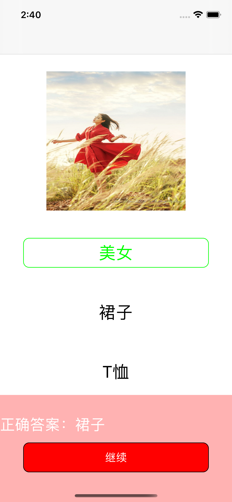

# IOS作业3项目报告

<center>黄皓佳 19309049</center>


## 项目分析

* 此次作业主要是在前面已经使用过的UI编程以及动画等知识的基础之上，再运用网络编程，通过指定的API获取题目以及判断答案对错，来完成一个简单的识别物品应用。
* 在UI编程上，此次页面比较简单，需要的控件也比较少，主要是涉及UILabel、UIButton、UIImage等常用的组件，以及通过继承UIView实现自定义组件。
* 动画还是基于UIView Animation的关键帧动画来实现，主要就是运用`animateKeyframesWithDuration: delay: options: animations: `函数
* 网络编程是基于NSURLSession的网络访问，通过get请求获取题目，通过post请求提交答案进行结果正确性判断

## 设计思路

* 此次作业的代码可以根据继承的父类分为三部分

  * 继承自UIView：

  

  ​		ResultView是一个自定义的UIView，它就是在当选择答案之后点击继续按钮所弹出的UIView，它是一个矩形框带着一个UILabel，通过成员函数setAnswer可以设置其显示的文本。

  * 继承自UIViewController

    

    * ViewController是整个项目的根视图控制器 ，在ViewController中通过self.navigationController的setViewControllers导航至UnitViewController，从而进入应用的初始页面
    * UnitViewController是应用的初始页面，即只有一个圆形按钮，点击圆形按钮之后，同样再次通过self.navigationController的setViewControllers导航至答题页面QuestionViewController
    * QuestionViewController是一个答题页面，在其中有一个QuestionLoader类型的对象，负责通过网络请求加载题目，QuestionViewController获得题目之后将其呈现出来，再通过按钮和手势接受用户的响应，将用户的选择传给另一个对象——Judge类对象，Judge类对象会通过网络提交用户的选择，并返回答案是否正确，最后QuestionViewController再将结果呈现出来。当回答完所有题目之后，便跳转至ScoreViewController
    * ScoreViewController是最后呈现得分的页面，在其中有一个ScoreRecorded类对象，该对象是负责记录用户在答题页面所获得的分数，ScoreViewController通过ScoreRecorded便可获得最终的得分并结合关键帧动画将其展示出来。
    
  * 继承自NSObject

    

    * Question顾名思义就是存放一个问题的对象，包括图片的URL、图片、题目id、选项等，通过一系列get函数使得外部可以获取问题的具体信息。
    * QuestionLoader通过网络获取问题，为每个问题创建一个Question类对象进行存放，通过NSMutableArray组织起来，并对外暴露get函数，从而使得QuestionViewController能够获取问题。
    * Judge类负责判断答案的正误，它有两个主要的函数——judge函数将传入的问题以及选择的答案通过网络post请求来判断答案是否正确，另一个函数——getCorrectAnswer则是将传入的问题，直接遍历其选项，通过post请求选出正确答案，此函数主要是为了后面显示正确答案的需要。
    * ScoreRecorder负责在答题页面根据Judge的返回结果进行分数的记录，最终在分数页面将分数呈现出来。
  
    

## 代码分析

按实现要点逐个进行分析

* 初始页面仅包含一个圆形按钮，点击按钮进入答题页面，按钮从左上角到右下角颜色渐变

  ```objective-c
  - (void)viewDidLoad {
      [super viewDidLoad];
      self.qc = [[QuestionViewController alloc]init];
      if(self.circleView == nil) {
          self.circleView = [[UIView alloc] initWithFrame:CGRectMake(0,0,200,200)];
          self.circleView.center = self.view.center;
          self.circleView.alpha = 0.5;
          //设置为圆形
          self.circleView.layer.cornerRadius = 100;
          
          //设置渐变层
          CAGradientLayer *gradient = [CAGradientLayer layer];
          //设置渐变开始和结束位置(设置渐变的方向)
          gradient.startPoint = CGPointMake(0, 0);
          gradient.endPoint = CGPointMake(1, 1);
          gradient.frame = CGRectMake(0,0,200,200);
          gradient.cornerRadius = 100;
          //渐变的颜色为紫色、红色、白色
          gradient.colors = [NSArray arrayWithObjects:(id)[UIColor purpleColor].CGColor,(id)[UIColor redColor].CGColor,(id)[UIColor whiteColor].CGColor,nil];
          [self.circleView.layer insertSublayer:gradient atIndex:0];
          
          //添加点击识别手势
          UIGestureRecognizer* click = [[UITapGestureRecognizer alloc] initWithTarget:self action:@selector(goSelect)];
          [self.circleView addGestureRecognizer:click];
          [self.view addSubview:self.circleView];
          self.label = [[UILabel alloc] initWithFrame:CGRectMake(0, 0, 58, 58)];
          self.label.center = self.view.center;
          self.label.text = @"识别";
          self.label.font = [UIFont systemFontOfSize:28];
          [self.view addSubview:self.label];
      }
  }
  
  //点击之后跳转至选择题页面
  - (void)goSelect{
      [self.navigationController setViewControllers:@[self.qc]];
  }
  ```

* 页面底部有一个UIButton，当每选中任何选项时，按钮为灰色，不响应点击

  ```objc
  //主要负责加载题目
  - (void)viewWillAppear:(BOOL)animated{
      self.stage++;
      self.curQuestion = [self.questionLoader getQuestion:self.stage];
      self.question = [self.curQuestion getQuestion];
      self.choiceList = [self.curQuestion getChoiceList];
      //呈现问题图片
      [self.imageView setImage:self.question];
      [self.view addSubview:self.imageView];
      //呈现选项
      [self.choice1 setText:[self.choiceList objectAtIndex:0]];
      [self.choice2 setText:[self.choiceList objectAtIndex:1]];
      [self.choice3 setText:[self.choiceList objectAtIndex:2]];
      //刚呈现，未选择时选项为黑色字体且没有边框
      self.choice1.textColor = [UIColor blackColor];
      self.choice2.textColor = [UIColor blackColor];
      self.choice3.textColor = [UIColor blackColor];
      
      self.choice1.layer.borderWidth = 0;
      self.choice2.layer.borderWidth = 0;
      self.choice3.layer.borderWidth = 0;
      
      [self.choice1 setUserInteractionEnabled:TRUE];
      [self.choice2 setUserInteractionEnabled:TRUE];
      [self.choice3 setUserInteractionEnabled:TRUE];
      
      //还未选择选项时底部按钮为灰色且不能响应点击
      [self.button setBackgroundColor:[UIColor grayColor]];
      [self.button setUserInteractionEnabled:FALSE];
  }
  ```

* 选中任意选项之后，该选项文字变为绿色，且背景变为绿色的圆角矩形框，底部按钮背景色也变为绿色

  ```objective-c
  //选项一的响应函数
  -(void)select1{
      self.curChoice = self.choice1.text;
      [self change:1];
  }
  //选项二的响应函数
  -(void)select2{
      self.curChoice = self.choice2.text;
      [self change:2];
  }
  //选项三的响应函数
  -(void)select3{
      self.curChoice = self.choice3.text;
      [self change:3];
  }
  ```

  ```objective-c
  //负责更新选项的状态
  -(void)change:(int)num{
      //有选项被选中，则将底部按钮颜色设置为绿色
      [self.button setBackgroundColor:[[UIColor alloc]initWithRed:10/255.0 green:165/255.0 blue:15/255.0 alpha:1]];
      [self.button setUserInteractionEnabled:TRUE];
      //若当前选中第一个选项，则将其颜色设为绿色并加上边框
      if(num == 1){
          self.choice1.textColor = [UIColor greenColor];
          self.choice2.textColor = [UIColor blackColor];
          self.choice3.textColor = [UIColor blackColor];
          
          self.choice1.layer.borderWidth = 1;
          self.choice2.layer.borderWidth = 0;
          self.choice3.layer.borderWidth = 0;
      }
      if(num == 2){
          self.choice2.textColor = [UIColor greenColor];
          self.choice1.textColor = [UIColor blackColor];
          self.choice3.textColor = [UIColor blackColor];
          
          self.choice1.layer.borderWidth = 0;
          self.choice2.layer.borderWidth = 1;
          self.choice3.layer.borderWidth = 0;
      }
      if(num == 3){
          self.choice3.textColor = [UIColor greenColor];
          self.choice1.textColor = [UIColor blackColor];
          self.choice2.textColor = [UIColor blackColor];
          
          self.choice1.layer.borderWidth = 0;
          self.choice2.layer.borderWidth = 0;
          self.choice3.layer.borderWidth = 1;
      }
  }
  ```

* 点击底部“确认”按钮后，按钮文字变为“继续”，并且页面底部弹出一个UIView，点击“继续”按钮后UIView向下移动收回，页面上显示的题目替换为下一道

  ```objective-c
  //底部按钮被点击到响应函数
  -(void)btnClick{
      //若当前为“确认”按钮
      if([[self.button currentTitle] isEqual:@"确认"]){
          //选项不能继续响应点击
          [self.choice1 setUserInteractionEnabled:FALSE];
          [self.choice2 setUserInteractionEnabled:FALSE];
          [self.choice3 setUserInteractionEnabled:FALSE];
          //判断用户选择的选项是否正确，然后通过recorder进行分数统计并弹出相应的UIView
          if([self.theJudge judge:[self.curQuestion getID] withChoice:self.curChoice]){
              [self.recorder record:1];
              [self openResView:0];
          }
          else{
              [self.recorder record:0];
              [self.button  setBackgroundColor:[UIColor redColor]];
              [self openResView:1];
          }
          //变为“继续”按钮
          [self.button setTitle:@"继续" forState:UIControlStateNormal];
      }
      //若当前为“继续”按钮
      else{
          [self.button setTitle:@"确认" forState:UIControlStateNormal];
          [self closeResView];
          //若题目已经答完，则跳转至得分页面
          if(self.stage == 3){
              [self.navigationController setViewControllers:@[self.sc]];
          }
          //否则刷新页面，加载新的题目
          else{
              [self viewWillAppear:YES];
          }
      }
  }
  ```

  ```objective-c
  //弹出自定义的UIView
  -(void)openResView:(int)sel{
      //在左上角显示正确答案
      [self.resView setAnswer:[self.theJudge getCorrectAnswer:self.curQuestion]];
      //若答案正确，则背景颜色为绿色
      if(sel == 0){
          [self.resView setBackgroundColor:[UIColor greenColor]];
      }
      //若答案不正确，则背景颜色为红色
      else{
          [self.resView setBackgroundColor:[UIColor redColor]];
      }
      //弹出动画
      [UIView animateKeyframesWithDuration:0.5 delay:0 options:UIViewKeyframeAnimationOptionCalculationModeLinear animations:^{
              [UIView addKeyframeWithRelativeStartTime:0 relativeDuration:0.1 animations: ^{
                  [self.resView setFrame:CGRectMake(0, self.view.bounds.size.height, self.view.bounds.size.width, 0)];
              }];
              [UIView addKeyframeWithRelativeStartTime:0.1 relativeDuration:0.4 animations: ^{
                  [self.resView setFrame:CGRectMake(0, self.view.bounds.size.height-180, self.view.bounds.size.width, 200)];
                  //通过设置透明度使得颜色与按钮颜色区分开
                  [self.resView setAlpha:0.3];
              }];
          } completion:nil];
      //将弹出的UIView置于底层，从而不会挡住按钮，使得按钮可以背点击
      [self.view sendSubviewToBack:self.resView];
  }
  ```

  ```objective-c
  //收回弹出的UIView
  -(void)closeResView{
      //一个持续0.5秒的动画
      [UIView animateKeyframesWithDuration:0.5 delay:0 options:UIViewKeyframeAnimationOptionCalculationModeLinear animations:^{
              [UIView addKeyframeWithRelativeStartTime:0 relativeDuration:0.1 animations: ^{
                  [self.resView setFrame:CGRectMake(0, self.view.bounds.size.height-180, self.view.bounds.size.width, 200)];
              }];
              [UIView addKeyframeWithRelativeStartTime:0.1 relativeDuration:0.4 animations: ^{
                  [self.resView setFrame:CGRectMake(0, self.view.bounds.size.height, self.view.bounds.size.width, 0)];
              }];
          } completion:nil];
  }
  ```

  ```objective-c
  @interface ResultView()
  @property(strong, nonatomic) UILabel * label;
  @end
  @implementation ResultView
  - (id)initWithFrame:(CGRect)frame {
      if (self = [super initWithFrame:frame]) {
          self.backgroundColor = [UIColor whiteColor];
      }
      self.label = [[UILabel alloc]initWithFrame:CGRectMake(0, 0, self.bounds.size.width, 100)];
      self.label.textColor = [UIColor whiteColor];
      self.label.font = [UIFont systemFontOfSize:25];
      [self addSubview:self.label];
      return self;
  }
  -(void)setAnswer:(NSString*)a{
      self.label.text = [@"正确答案：" stringByAppendingString:a];
  }
  @end
  ```

  ```objective-c
  //主要负责加载题目
  - (void)viewWillAppear:(BOOL)animated{
      self.stage++;
      self.curQuestion = [self.questionLoader getQuestion:self.stage];
      self.question = [self.curQuestion getQuestion];
      self.choiceList = [self.curQuestion getChoiceList];
      //呈现问题图片
      [self.imageView setImage:self.question];
      [self.view addSubview:self.imageView];
      //呈现选项
      [self.choice1 setText:[self.choiceList objectAtIndex:0]];
      [self.choice2 setText:[self.choiceList objectAtIndex:1]];
      [self.choice3 setText:[self.choiceList objectAtIndex:2]];
      //刚呈现，未选择时选项为黑色字体且没有边框
      self.choice1.textColor = [UIColor blackColor];
      self.choice2.textColor = [UIColor blackColor];
      self.choice3.textColor = [UIColor blackColor];
      
      self.choice1.layer.borderWidth = 0;
      self.choice2.layer.borderWidth = 0;
      self.choice3.layer.borderWidth = 0;
      
      [self.choice1 setUserInteractionEnabled:TRUE];
      [self.choice2 setUserInteractionEnabled:TRUE];
      [self.choice3 setUserInteractionEnabled:TRUE];
      
      //还未选择选项时底部按钮为灰色且不能响应点击
      [self.button setBackgroundColor:[UIColor grayColor]];
      [self.button setUserInteractionEnabled:FALSE];
  }
  ```

* 完成所有题目之后，进入分数界面，显示正确题数

  ```objective-c
  //
  //  ScoreViewController.m
  //  19309049HuangHaoJia
  //
  //  Created by student5 on 2021/10/31.
  //
  
  #import "ScoreViewController.h"
  
  @interface ScoreViewController ()
  @property(strong, nonatomic) ScoreRecorder* recorder;//分数记录器
  @property(strong, nonatomic) UILabel * label;//“正确数“文本
  @property(strong, nonatomic) UILabel * scoreLabel;//显示正确的题目数
  @property(strong, nonatomic) NSMutableArray * records;//存放各个题目的答题记录（正确与否）
  @property(strong, nonatomic) UIImage * star0;//空心星星图片
  @property(strong, nonatomic) UIImage * star1;//实心星星图片
  @property(strong, nonatomic) NSMutableArray * imgViews;//分别放置四个星星图片
  @property NSInteger score;//得分
  @end
  @implementation ScoreViewController
  
  //使得与QuestionViewController共用一个ScoreRecorder
  -(id)initWithRecorder:(ScoreRecorder*)r{
      self = [super init];
      self.recorder = r;
      return self;
  }
  
  - (void)viewDidLoad {
      [super viewDidLoad];
      self.score = 0;
      
      self.label = [[UILabel alloc]initWithFrame:CGRectMake(self.view.bounds.size.width/5, 120, self.view.bounds.size.width*3/5, self.view.bounds.size.width*3/5)];
      self.label.text = @"正确数";
      self.label.font = [UIFont systemFontOfSize:28];
      self.label.textAlignment = UIListContentTextAlignmentCenter;
      [self.view addSubview:self.label];
      
      self.scoreLabel =  [[UILabel alloc]initWithFrame:CGRectMake(self.view.bounds.size.width/5, 300, self.view.bounds.size.width*3/5, self.view.bounds.size.width*3/5)];
      self.scoreLabel.text = [NSString stringWithFormat:@"%ld",self.score];
      self.scoreLabel.font = [UIFont systemFontOfSize:28];
      self.scoreLabel.textAlignment = UIListContentTextAlignmentCenter;
      [self.view addSubview:self.scoreLabel];
      
      self.star0 = [UIImage imageNamed:@"star0.png" inBundle:[NSBundle mainBundle] compatibleWithTraitCollection:nil];
      self.star1 = [UIImage imageNamed:@"star1.png" inBundle:[NSBundle mainBundle] compatibleWithTraitCollection:nil];
      
      self.imgViews = [[NSMutableArray alloc]init];
      //初始化四个星星的位置
      for(int i = 0;i < 4;++i){
          UIImageView * iv = [[UIImageView alloc]initWithFrame:CGRectMake(self.view.bounds.size.width/6*i+(i+1)*self.view.bounds.size.width/15, 600, self.view.bounds.size.width/6, 80)];
          [self.imgViews addObject:iv];
          [iv setImage:self.star0];
          [self.view addSubview:iv];
      }
      self.records = [self.recorder getRecords];
  }
  
  -(void)viewWillAppear:(BOOL)animated{
      //从左到右依次放大缩小动画
      for(int i = 0;i < 4;++i){
          [UIView animateKeyframesWithDuration:0.5 delay:i*0.5 options:UIViewKeyframeAnimationOptionAllowUserInteraction animations:^{
                  [UIView addKeyframeWithRelativeStartTime:0 relativeDuration:0.3 animations: ^{
                      [[self.imgViews objectAtIndex:i] setFrame:CGRectMake(self.view.bounds.size.width/6*i+(i+1)*self.view.bounds.size.width/15-25, 580, self.view.bounds.size.width/6+50, 120)];
                  }];
              [UIView addKeyframeWithRelativeStartTime:0.3 relativeDuration:0.2 animations: ^{
                      [[self.imgViews objectAtIndex:i] setFrame:CGRectMake(self.view.bounds.size.width/6*i+(i+1)*self.view.bounds.size.width/15, 600, self.view.bounds.size.width/6, 80)];
                  }];
          } completion:^(BOOL finished){
              //若对应的题目回答正确则变为实心星星
              if([[self.records objectAtIndex:i] isEqual:@"1"]){
                  [[self.imgViews objectAtIndex:i] setImage:self.star1];
                  self.score++;
                  self.scoreLabel.text = [NSString stringWithFormat:@"%ld",self.score];
              }
              
          }];
      }
  }
  @end
  
  ```

* QuestionLoader的具体实现

  * 问题的加载的步骤是先通过NSURLSession从指定的API获取数据，然后转换为json格式的字符串，再自己实现一个字符串的扫描函数截取出其中的数据进行存储

  ```objective-c
  -(void)loadQuestion{
      //通过一个信号量，使得请求得以同步，即获取到请求之后再执行下面的存储，保证获取到的问题可以顺利地存储
      dispatch_semaphore_t semaphore = dispatch_semaphore_create(0);
      NSURL * url = [NSURL URLWithString:@"http://172.18.178.56:8360/hw3/get_question"];
      NSURLRequest *request = [NSURLRequest requestWithURL:url];
      NSURLSessionDataTask * dataTask = [[NSURLSession sharedSession] dataTaskWithRequest:request
         completionHandler:^(NSData *data, NSURLResponse *response, NSError *error){
          if(error == nil){
              self.text  = [[NSString alloc] initWithData: data encoding:NSUTF8StringEncoding];
          }
          dispatch_semaphore_signal(semaphore);
         }];
      [dataTask resume];
      //等待请求任务结束再执行下面的操作
      dispatch_semaphore_wait(semaphore, DISPATCH_TIME_FOREVER);
      NSString * text = self.text;
      NSString * idStr = @"id";
      NSString * imageStr = @"image";
      NSString * choice1Str = @"choice1";
      NSString * choice2Str = @"choice2";
      NSString * choice3Str = @"choice3";
  
      NSRange range = [self.text rangeOfString:idStr];
      NSInteger location = range.location;
  
      NSString * questionID;
      NSString * imageURL;
      NSString * choice1;
      NSString * choice2;
      NSString * choice3;
  
      NSInteger begin;
      //若当前待搜索的字符串中能找到子串——“id”，说明还有数据，则继续提取
      while([text rangeOfString:idStr].length == 2){
          range = [text rangeOfString:idStr];
          location = range.location;
          //id值的开始位置
          location = location + 4;
          questionID = @"";
          //以逗号为结束符，扫描获取整个id值
          while(true){
              char c = [text characterAtIndex:location];
              if(c == ','){
                  break;
              }
              else{
                  questionID = [questionID stringByAppendingFormat:@"%c",c];
                  location++;
              }
          }
  
          range = [text rangeOfString:imageStr];
          location = range.location;
          //url的开始位置
          location = location + 8;
          imageURL = @"";
          //以双引号为结束符，扫描获取整个url值
          while(true){
              char c = [text characterAtIndex:location];
              if(c == '"'){
                  break;
              }
              else{
                  imageURL = [imageURL stringByAppendingFormat:@"%c",c];
                  location++;
              }
          }
  
          range = [text rangeOfString:choice1Str];
          location = range.location;
          //选项1的开始位置
          location = location + 10;
          choice1 = @"";
          begin = location;
          //以双引号为结束符，扫描获取整个选项1的长度，由于选项有中文，因此若像前面一样逐个字符添加会造成乱码
          //因此选择获取选项的长度，然后通过substringWithRange函数直接获取子串
          while(true){
              char c = [text characterAtIndex:location];
              if(c == '"'){
                  break;
              }
              else{
                  location++;
              }
          }
          choice1 = [text substringWithRange:NSMakeRange(begin, location-begin)];
  
  
          range = [text rangeOfString:choice2Str];
          location = range.location;
          location = location + 10;
          choice2 = @"";
          begin = location;
          while(true){
              char c = [text characterAtIndex:location];
              if(c == '"'){
                  break;
              }
              else{
                  location++;
              }
          }
          choice2 = [text substringWithRange:NSMakeRange(begin, location-begin)];
  
          range = [text rangeOfString:choice3Str];
          location = range.location;
          location = location + 10;
          choice3 = @"";
          begin = location;
          while(true){
              char c = [text characterAtIndex:location];
              if(c == '"'){
                  break;
              }
              else{
                  location++;
              }
          }
          choice3 = [text substringWithRange:NSMakeRange(begin, location-begin)];
          //创建新的问题对象
          Question * question = [[Question alloc]init:questionID withQuestionURL:imageURL withChoice1:choice1 withChoice2:choice2 withChoice3:choice3];
          //添加到问题数组中
          [questions addObject:question];
          //截断已经扫描过的部分，进入下一次循环
          text = [text substringFromIndex:location];
      }
  }
  ```

  * 除了问题的加载函数，对外暴露一个get函数以便获取问题

  ```objective-c
  - (Question*)getQuestion:(NSInteger)num{
      return [questions objectAtIndex:num];
  }
  ```

* Judge的具体实现

  ```objective-c
  //判断选项是否正确
  -(BOOL)judge:(NSString*)ID withChoice:(NSString*)choice{
      //应用信号量同步请求操作
      dispatch_semaphore_t semaphore = dispatch_semaphore_create(0);
      NSURL * url = [NSURL URLWithString:@"http://172.18.178.56:8360/hw3/query"];
      NSMutableURLRequest * urlRequest = [NSMutableURLRequest requestWithURL:url];
      [urlRequest setHTTPMethod:@"POST"];
      //请求的数据
      NSDictionary *dic = @{@"number": ID, @"choice":choice};
      NSError *error = nil;
      //转换为json格式
      NSData *jsonData = [NSJSONSerialization dataWithJSONObject:dic options:NSJSONWritingPrettyPrinted error:&error];
      NSString *jsonString = [[NSString alloc] initWithData:jsonData encoding:NSUTF8StringEncoding];
      [urlRequest setHTTPBody:[jsonString dataUsingEncoding:NSUTF8StringEncoding]];
      
      NSURLSessionDataTask * dataTask =[[NSURLSession sharedSession] dataTaskWithRequest:urlRequest completionHandler:^(NSData *data, NSURLResponse *response, NSError *error) {
          if(error == nil) {
              //将获取到的响应转为字符串
              self.text = [[NSString alloc] initWithData: data encoding: NSUTF8StringEncoding];
          }
          dispatch_semaphore_signal(semaphore);
      }];
      [dataTask resume];
      dispatch_semaphore_wait(semaphore, DISPATCH_TIME_FOREVER);
      //寻找其中是否有带true的子串，若有则返回true，否则返回false
      NSRange range = [self.text rangeOfString:@"true"];
      NSInteger len = range.length;
      if(len > 0){
          return true;
      }
      return false;
  }
  //获取传入的题目的正确答案
  -(NSString*)getCorrectAnswer:(Question*)q{
      NSString* ID = [q getID];
      NSMutableArray * choices = [q getChoiceList];
      //遍历选项，逐个尝试，得出正确结果
      for(NSInteger i = 0;i < [choices count];++i){
          dispatch_semaphore_t semaphore = dispatch_semaphore_create(0);
          NSURL * url = [NSURL URLWithString:@"http://172.18.178.56:8360/hw3/query"];
          NSMutableURLRequest * urlRequest = [NSMutableURLRequest requestWithURL:url];
          [urlRequest setHTTPMethod:@"POST"];
          
          NSDictionary *dic = @{@"number": ID, @"choice":[choices objectAtIndex:i]};
          NSError *error = nil;
          NSData *jsonData = [NSJSONSerialization dataWithJSONObject:dic options:NSJSONWritingPrettyPrinted error:&error];
          NSString *jsonString = [[NSString alloc] initWithData:jsonData encoding:NSUTF8StringEncoding];
          [urlRequest setHTTPBody:[jsonString dataUsingEncoding:NSUTF8StringEncoding]];
          
          NSURLSessionDataTask * dataTask =[[NSURLSession sharedSession] dataTaskWithRequest:urlRequest completionHandler:^(NSData *data, NSURLResponse *response, NSError *error) {
              if(error == nil) {
                  self.text = [[NSString alloc] initWithData: data encoding: NSUTF8StringEncoding];
              }
              dispatch_semaphore_signal(semaphore);
          }];
          [dataTask resume];
          dispatch_semaphore_wait(semaphore, DISPATCH_TIME_FOREVER);
          NSRange range = [self.text rangeOfString:@"true"];
          NSInteger len = range.length;
          //若有true子串，说明已经找到正确选项
          if(len > 0){
              //返回对应的选项
              return [choices objectAtIndex:i];
          }
      }
      return nil;
  }
  ```

* ScoreRecorder的具体实现

  ```objective-c
  -(id)init{
      self = [super init];
      score = 0;
      records = [[NSMutableArray alloc]init];
      return self;
  }
  
  -(void)record:(NSInteger)result{
      //传入的result为0或1，0表示错误，1表示正确
      score = score + result;
      if(result == 1){
          [records addObject:@"1"];
      }
      else{
          [records addObject:@"0"];
      }
      
  }
  -(NSInteger)getScore{
      return  score;
  }
  -(NSMutableArray*)getRecords{
      return records;
  }
  ```

* Question的具体实现

  ```objective-c
  @interface Question : NSObject{
      NSString* questionID;//题目id
      UIImage * question;//题目图片
      NSString * questionURL;//图片的url
      NSMutableArray* choices;//存放选项的数组
  }
  -(id)init:(NSString*) _questionID withQuestionURL:(NSString*)_questionURL withChoice1:(NSString*) _choice1 withChoice2:(NSString*)_choice2 withChoice3:(NSString*)_choice3;
  -(UIImage*)getQuestion;
  -(NSString*)getChoice:(int)num;
  -(NSString*)getID;
  -(NSMutableArray*)getChoiceList;
  @end
  ```

  ```objective-c
  -(id)init:(NSString*) _questionID withQuestionURL:(NSString*)_questionURL withChoice1:(NSString*) _choice1 withChoice2:(NSString*)_choice2 withChoice3:(NSString*)_choice3{
      self = [super init];
      choices = [[NSMutableArray alloc]init];
      question = [[UIImage alloc]init];
      questionID = _questionID;
      [choices addObject:_choice1];
      [choices addObject:_choice2];
      [choices addObject:_choice3];
      questionURL = _questionURL;
      //通过url获取图片
      NSData * data = [NSData dataWithContentsOfURL:[NSURL URLWithString:questionURL]];
      question = [UIImage imageWithData:data];
      return self;
  }
  
  -(UIImage*)getQuestion{
      return question;
  }
  
  -(NSString*)getChoice:(int)num{
      return [choices objectAtIndex:num];
  }
  
  -(NSString*)getID{
      return questionID;
  }
  
  -(NSMutableArray*)getChoiceList{
      return choices;
  }
  ```

  

## 经验总结

* 基于NSURLSession的网络请求是异步进行的，即当进行网络请求时，有另外一个线程去执行，主线程将无阻塞地继续执行下面的操作，一开始没有注意到这一特点，导致无法获取请求得到的数据，最后的解决方法是利用信号量，将其变为同步的请求，确保请求完成之后再执行下面的数据处理操作。
* 之前还一直不理解`UIView animateKeyframesWithDuration: delay: options: animations:`中delay的作用，直到在考虑如何实现从左到右依次对每个星星进行放大缩小到时候才意识到delay就是可以用来设置不同动画执行前到延迟实现，以达到逐个呈现到效果。

## 效果展示

* 初始页面

  

* 答题页面——未选择选项

  

* 答题页面——选择正确

  

* 答题页面——选择错误

  

* 得分页面

  


